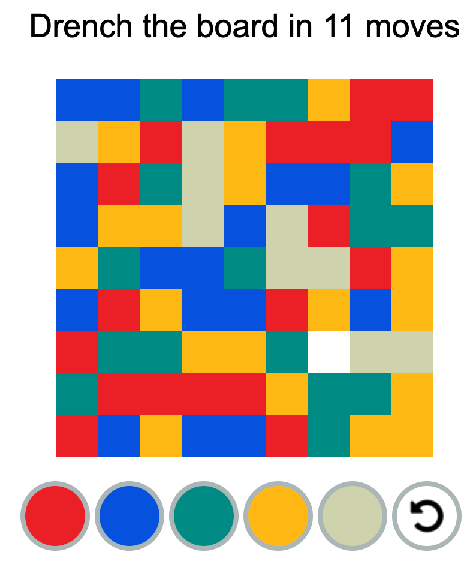

# hackathon2022-simon-says

```
git clone https://github.com/jaroslavasd/hackathon2022-solutions-playwright.git
cd hackathon2022-solutions-playwright
npm install
```

### Run
#### [simon-says](https://weslleyaraujo.github.io/react-simon-says/)
```npx playwright test simon-says --headed```
</br>
<a href="https://weslleyaraujo.github.io/react-simon-says/"></a>

#### [drench2](http://www.flashbynight.com/drench2/)
```npx playwright test drench2 --headed```
</br>
<a href="http://www.flashbynight.com/drench2/"></a>